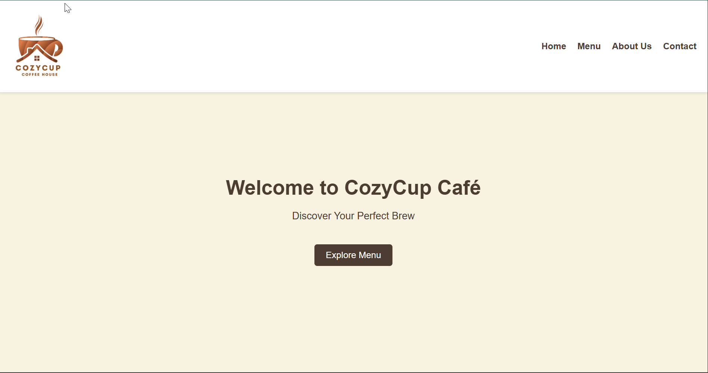
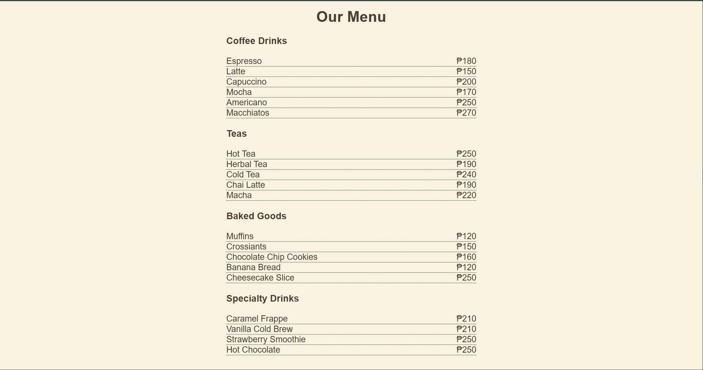

# **Cozy Cup Cafe**  

## Project Description  
> Cozy Cup Café is a simple website that showcases the café’s menu, story, and contact details. It is designed to provide users with easy navigation: Home, Menu, About Us, and Contact Us. The goal of the project is to create a clean and user-friendly site where customers can learn about the café, explore available items with prices, and connect with the business.  

## Features  
- Home page with a welcome message.
- Menu page showing items and prices.
- About Us page with café story and services.
- Contact Us page with Facebook, email, and phone number.
- Simple navigation between pages.

## Screen Captures  
  

> This is the Home page where the users can navigate to Home, Menu, About Us, and Contact Us.  

  

> This is the Menu page where users can view the available items and their prices.  

  

> This is the About Us page where users can know more about us and what we offer.  

  

> This is the Contact Us page where users can reach us through Facebook, email, and phone number.  

## About the authors  
  
  
**Name:** Samir D. Araah    
**Email:** samiraraah18@gmail.com  

  

**Name:** Ruzz M. Serra  
**Email:** ruzzyy.arres@gmail.com  

